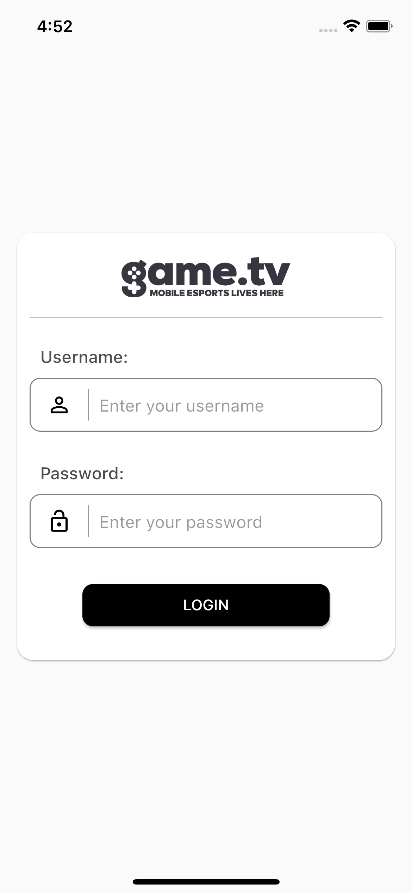
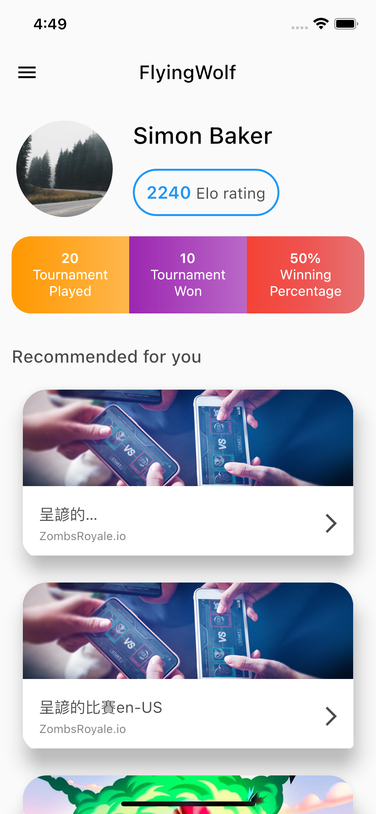
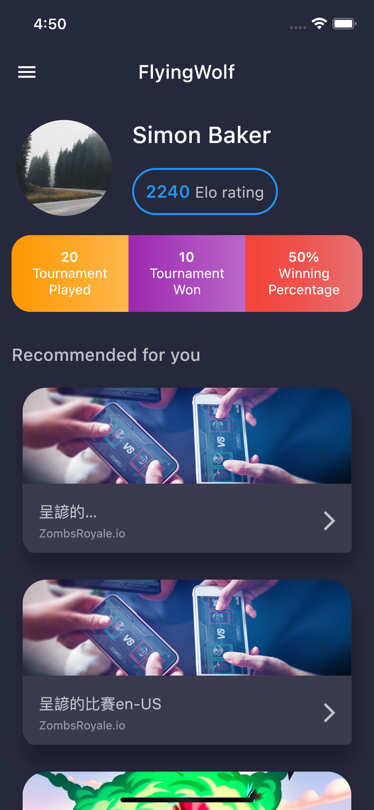

# bluestacks_flutter_dev_assignment

This project is created for the flutter developer assignment.
The flutter SDK version used in this project is v2.2.1 

## Assignment specifications:

**1. Login screen:**
   
  This will be the first screen.
  a. It is having 4 UI items:
  
    i. An image of game.tv logo
    ii. Username text field: It is having validation of min 3 characters and max 11 with proper error message if the validation fails.
    iii. Password field: It is having validation of min 3 characters and max 11 with proper error message if the validation fails.
    iv. Submit button: It is disabled if either validation fails.

  b. Other points:
  
    i. If a user is already logged in then they will directly navigate to the home screen next time when they open the app
    ii. No API is hitted when Submit button as the below mentioned valid login crendentials are hardcoded in the app
      User 1: 9898989898 / password123
      User 2: 9876543210 / password123
      User 3: 9898989890 / password123
      User 4: 9876543211 / password123
    iii. Some UI points:
      1. All 4 items are horizontally and vertically centered both, one below the other.

**2. Home screen:**
This will hold some information related to the logged in user, along with a few tournament cards:

  a. API:
  
    i. API to fetch the data for the User Details section i.e. the UI elements above “Recommended for you” section.
    ii. For the “Recommended for you” section, following api is used:
        http://tournaments-dot-game-tv-prod.uc.r.appspot.com/tournament/api/tournaments_list_v2?limit=10&status=all
    iii. loading spinners/error states are added as necessary.
    iv. Bloc state management solution is used in the application
    v. The api mentioned in point ii (tournaments_list_v2) supports pagination, with 10 items at first, then fetched the subsequent 10 items by specifying a cursor param in the subsequent api hit.
   
  b. The complete page is scrollable

## Bonus:
  a. Added analysis_options.yaml file with static linter check in the code.
  b. Bloc state management is used throughout the application
  c. Dark Mode / Light Mode support is added in the application and as per device 
    theme the app theme will be considered
  d. Localization with English and Japanese language

## Here are the screenshots of the assignment
  a. 
  b. 
  c. 

